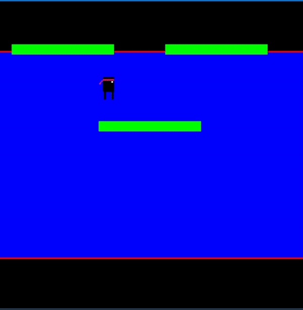
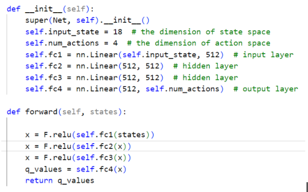

# Reinforcement Learning for a platformer type game

## Project Repository

Go to to DQN_custom_features (FINAL) to view the code explained below.

## Overview

We wanted to make an AI that could play a platformer, a classic arcade game in which the core objective is to move the player between falling platforms and try to  survive as long as possible.

To do this, we used Reinforcement Learning (RL), a method that trains the agent (player) by feeding rewards and observations to the agent after an action is taken in the environment. The code was written in Python 3.

## Methodology

There are essentially two parts in our project: the game environment and the DQN algorithm. 
The game environment deals with how the game works and most importantly how rewards are calculated in each step (frame) of the game.
The DQN part is where the neural networks and algorithms are located.

### 1. Game Environment (DQN_custom_features (FINAL)/LegendaryNinja_v0.py)
We used pygame, a set of modules, to write our game. The game sprites are platforms and one player.  The player has four actions: go left, go right, jump, and do nothing. We know the player has failed when it has touched the bottom or the top of the screen, thus it is game over. 	

At each step, we return the observation space back to DQN. We carefully select important features about the environment that the agent will find useful and feed them to the network. These features were: player’s coordinates, player’s vertical velocity, x coordinates of the left and right sides of each platform as well as y-coordinates of each platform. 

The reward is also returned at each step. We give the player a reward of 0.1 every iteration as an encouragement to stay alive. When the player touches the top or bottom of the screen, we give a negative reward of -1. But when the player jumps from one platform to another, which is the way to survive longer, we give a positive reward of 1.

The last return parameter is a True/False variable indicating whether the game is done. It is set to True, when the player crosses over either one of the red lines that signify the screen's top and bottom. It is also set to True when the player has done 2000 steps. The game is simple and the patterns that the agent can see are limited. So the reason for terminating the game at that point is if the agent has played for this long it means that it solved the game.
### 2. DDQN (DQN_custom_features (FINAL)/DQN.py)	
	
We used PyTorch to implement the neural networks. We use Adam as the optimizer, the learning rate is set to 1e-6, gamma to 0.99, experience replay can store 200,000 units and the target network is loaded from the evaluation network every 20 iterations. To start the training we have to fill the memory with some experiences. So first 10,000 iterations the agent performs random movements exploring the start of the game. Then the training starts. As in [1] we use an epsilon-greedy policy. At the first learning iteration, epsilon is set to 1 and then is linearly annealed to 0.01. In total 200,000 learning iterations are performed. At this point, the agent should be trained well enough to actually beat the game. So we continue to train it with epsilon held at 0.01, while checking every new version of the target net for success in the game. If this current version is able to beat the game, we cease the training and save the weights.

Neural network used by our algorithm:

## Results

Our algorithm has successfully beaten the game. The model has found optimal network weight at the iteration number 40 of the last phase of training, where learning was done with epsilon held constant.
During training, there were two evaluation metrics that we used: maximum Q-value of the starting state, which is the same state in every game, and the amount of steps/frames the agent has progressed. Here we show graphs taken from a successful training.

<u>Maximum Q-value of the starting state</u>: The closer algorithm to the true value of Q the better it estimates and takes actions. In our case, this value is around 10.5. We can see that our model’s guess is two times bigger. In general, as seen in [1] and [2] DQN tends to overestimate this value. Nonetheless, looking at the graph we can see that the neural net has not converged yet, but is about to. This is good news.

<u>Amount of steps/frames the agent has progressed</u>: This metric is simple to understand. More steps the agent can take means it can advance further in the game. We can see that on the last games that the agent has played, it was really close to completing the game or has completed it.

In conclusion, we have trained the network until convergence and got the good weights that allow the agent to complete the game.

## Future work

1. We have started working and are continuing to work on AI that receives a different observation space. This approach follows [1] and feeds the entire screen as an observation space. The screen is first resized to 84x84 pixels and is then converted to gray. In this case, the features that were previously human-picked are now engineered by the net. 
2. So far it is not clear to us, how changing some parameters affects the training results: like the capacity of the experience replay and the frequency at which we load the evaluation into the target net. More experiments need to be done.
3. The game we have created is fairly simple. It would be interesting to increase the difficulty by adding more randomness into the size and shape of platforms, as well as making spiky sections on them. 

## References

The papers that we have relied upon were:

[1] Mnih, Volodymyr, Koray Kavukcuoglu, David Silver, Andrei A. Rusu, Joel Veness, Marc G. Bellemare, Alex Graves, Martin Riedmiller, Andreas K. Fidjeland, Georg Ostrovski, Stig Petersen, Charles Beattie, Amir Sadik, Ioannis Antonoglou, Helen King, Dharshan Kumaran, Daan Wierstra, Shane Legg, and Demis Hassabis. Human-level Control through Deep Reinforcement Learning. Nature, 529-33, 2015.

[2] Hado van Hasselt, Arthur Guez, David Silver. Deep Reinforcement Learning with Double Q-learning. AAAI 2016.

The github repositories that we have relied upon were:
1. https://github.com/yenchenlin/DeepLearningFlappyBird
2. https://github.com/nikitasrivatsan/DeepLearningVideoGames
3. https://github.com/s094392/DownstairKid

